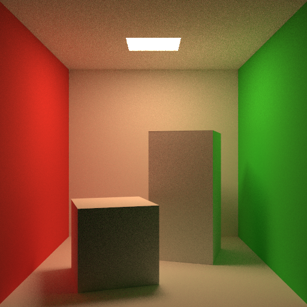
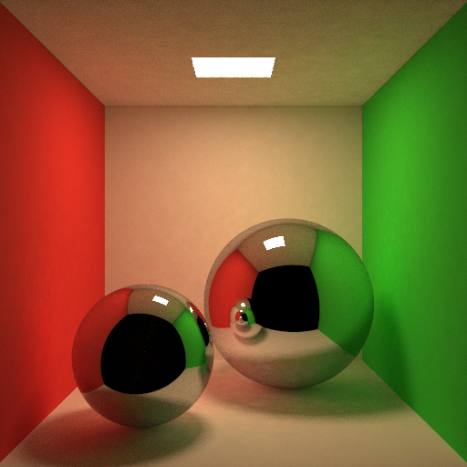

# photon_mapping

minimal but extensible header only implementation of photon mapping in C++.

## Features

* Direct illumination with explicit light sampling
* Indirect illumination with final gathering
* Caustics photon map
* Reference integrator(Path tracing)

## Requirements

* C++ (20>=)
* CMake (3.20>=)
* [spdlog](https://github.com/gabime/spdlog)
* OpenMP

## Build

|CMake option|Description|
|:--|:--|
|BUILD_TESTS|build tests|

```
mkdir build
cd build
cmake -DCMAKE_BUILD_TYPE=Release ..
make
```

## Structure

|Name|Description|
|:--|:--|
|`include/camera.h`|ray generation from camera|
|`include/core.h`|math, basic data types|
|`include/image.h`|image|
|`include/integrator.h`|implement photon mapping, path tracing(for reference)|
|`include/light.h`|area light object|
|`include/photon_map.h`|implementation of photon map with kdtree|
|`include/primitive.h`|primitive object|
|`include/sampler.h`|random number generation, sampling utilities|
|`include/scene.h`|scene object. ray-scene intersection|
|`include/shape.h`|shape object. ray-primitive intersection, sampling a point on the shape|

## Gallery

### Cornell box without final gathering

|Parameter|Value|
|:--|:--| 
|number of photons|1000000|
|number of nearest neighbors|100|
|number of samples|100|


### Cornell box with final gathering

|Parameter|Value|
|:--|:--| 
|number of photons|1000000|
|number of nearest neighbors|100|
|number of samples|100|



### Cornell box with mirror spheres

|Parameter|Value|
|:--|:--| 
|number of photons|1000000|
|number of nearest neighbors|100|
|number of samples|100|



## References

* Jensen, Henrik Wann. Realistic image synthesis using photon mapping. AK Peters/crc Press, 2001.
* https://pbr-book.org/3ed-2018/Light_Transport_III_Bidirectional_Methods/Stochastic_Progressive_Photon_Mapping# 
* http://www.cs.cmu.edu/afs/cs/academic/class/15462-s12/www/lec_slides/lec18.pdf
* [Jensen, Henrik Wann. "Global illumination using photon maps." Eurographics workshop on Rendering techniques. Springer, Vienna, 1996.](https://link.springer.com/chapter/10.1007/978-3-7091-7484-5_3)
* [Christensen, Per H. "Faster photon map global illumination." Journal of graphics tools 4.3 (1999): 1-10.](https://doi.org/10.1080/10867651.1999.10487505)
* [Hachisuka, Toshiya, Jacopo Pantaleoni, and Henrik Wann Jensen. "A path space extension for robust light transport simulation." ACM Transactions on Graphics (TOG) 31.6 (2012): 1-10.](https://dl.acm.org/doi/10.1145/2366145.2366210)